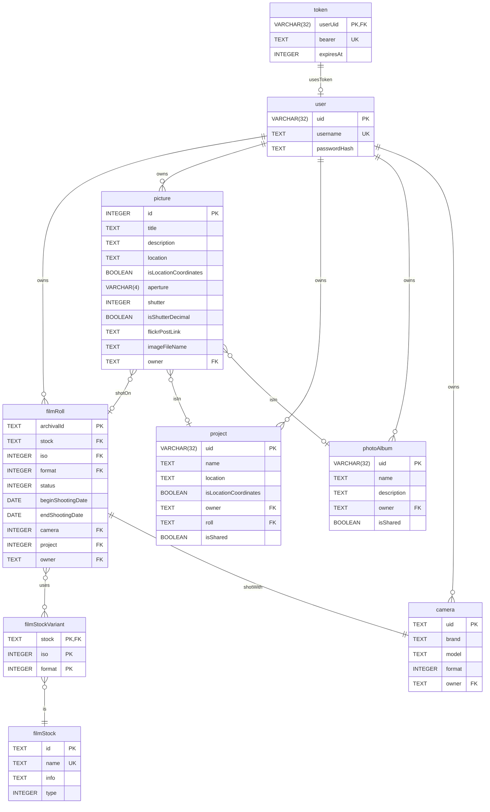

# Database Entity Relationship

```mermaid
erDiagram

filmStock {
	TEXT id PK
	TEXT name UK
	TEXT info
	INTEGER type
}

filmStockVariant {
	TEXT stock PK, FK
	INTEGER iso PK
	INTEGER format PK
}

filmRoll{
	TEXT archivalId PK
	TEXT stock FK
	INTEGER iso FK
	INTEGER format FK
	INTEGER status
	DATE beginShootingDate
	DATE endShootingDate
	INTEGER camera FK
	INTEGER project FK
	TEXT owner FK
}

picture{
	INTEGER id PK
	TEXT title
	TEXT description
	TEXT location
	BOOLEAN isLocationCoordinates
	VARCHAR(4) aperture
	INTEGER shutter
	BOOLEAN isShutterDecimal
	TEXT flickrPostLink
	TEXT imageFileName
	TEXT owner FK
}

user{
	VARCHAR(32) uid PK
	TEXT username UK
	TEXT passwordHash
}

token{
    VARCHAR(32) userUid PK, FK
    TEXT bearer UK
    INTEGER expiresAt
}

project{
	VARCHAR(32) uid PK
	TEXT name
	TEXT location
	BOOLEAN isLocationCoordinates
	TEXT owner FK
	TEXT roll FK
	BOOLEAN isShared
}

photoAlbum{
	VARCHAR(32) uid PK
	TEXT name
	TEXT description
	TEXT owner FK
	BOOLEAN isShared
}

camera{
	TEXT uid PK
	TEXT brand
	TEXT model
	INTEGER format
	TEXT owner FK
}

filmStockVariant }o--|| filmStock : is
filmRoll }o--o{ filmStockVariant : uses
filmRoll ||--|| camera : shotWith
picture }o--o| filmRoll : shotOn
user ||--o{ filmRoll : owns
user ||--o{ picture : owns
user ||--o{ project : owns
user ||--o{ photoAlbum : owns
user ||--o{ camera : owns
token ||--o| user : usesToken
picture }o--o| project : isIn
picture }o--o| photoAlbum : isIn
```